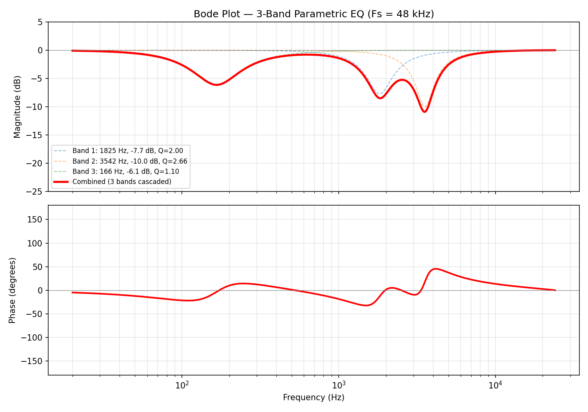

# 3-Band Parametric EQ on Speaker Output

## Overview

A 3-band parametric equalizer has been added to the Satellite1 speaker output path. The EQ processes audio immediately before it is sent to the DAC via I2S, shaping the frequency response of the speaker output. The AEC reference signal is derived downstream of the EQ, so it accurately models what the speaker produces.

## Signal Path

```
Audio Source (USB or I2S)
        │
        ▼
  speaker_pipeline_input()
        │
        ▼
  speaker_pipeline_output()
        │
        ├── Pack into interleaved tmp buffer
        │
        ├── *** 3-Band Parametric EQ (new) ***
        │
        ├── rtos_i2s_tx_1() → DAC → Speaker
        │
        └── Downsample 48kHz → 16kHz → AEC reference queue
```

The EQ applies to all audio reaching the speaker, regardless of source.

## EQ Band Definitions

All bands are **peaking EQ** filters (Robert Bristow-Johnson Audio EQ Cookbook).

| Band | Frequency (Hz) | Gain (dB) | Q    | Purpose |
|------|-----------------|-----------|------|---------|
| 1    | 1825            | -7.7      | 2.00 | Mid cut |
| 2    | 3542            | -10.0     | 2.66 | Upper-mid cut |
| 3    | 166             | -6.1      | 1.10 | Low-frequency cut |

## Frequency Response



The combined response shows three distinct notches at the target frequencies. Bands 1 and 2 overlap in the 1–4 kHz region, creating a broad cut reaching approximately -12 dB. The phase response remains well-behaved with no abrupt discontinuities.

## Implementation Details

**Sample rate:** 48,000 Hz
**Sample format:** int32_t, 24-bit left-justified
**Frame size:** 720 samples per channel (240 × 3 SR factor)
**Channels:** 2 (L/R stereo, processed independently)

### Fixed-Point Arithmetic

- Coefficients stored in **Q28** format (1 sign bit, 3 integer bits, 28 fractional bits)
- Q28 chosen because the largest coefficient magnitudes reach ~2.0, well within the [-8, +8) range
- Multiply-accumulate uses `int64_t`: each product is 32×32 = 64 bits, and the sum of 5 products cannot overflow a 64-bit accumulator
- Final result shifted right by 28 to return to int32_t sample format

### Filter Structure

Direct Form I biquad, 3 sections cascaded per channel:

```
y[n] = b0·x[n] + b1·x[n-1] + b2·x[n-2] - a1·y[n-1] - a2·y[n-2]
```

Each biquad maintains 4 words of state (x1, x2, y1, y2). Total state: 3 bands × 2 channels × 4 words = 24 int32_t values, allocated as `static` locals.

### Q28 Coefficients

Computed from the Audio EQ Cookbook peaking EQ formulas at Fs = 48000 Hz:

**Band 1** (1825 Hz, -7.7 dB, Q=2.00):
| Coeff | Float | Q28 |
|-------|-------|-----|
| b0 | 0.9503950317 | 255119724 |
| b1 | -1.7792416023 | -477611531 |
| b2 | 0.8808525989 | 236452069 |
| a1 | -1.7792416023 | -477611531 |
| a2 | 0.8312476305 | 223136337 |

**Band 2** (3542 Hz, -10.0 dB, Q=2.66):
| Coeff | Float | Q28 |
|-------|-------|-----|
| b0 | 0.9110778211 | 244565590 |
| b1 | -1.5562208438 | -417744852 |
| b2 | 0.8288291992 | 222487144 |
| a1 | -1.5562208438 | -417744852 |
| a2 | 0.7399070203 | 198617278 |

**Band 3** (166 Hz, -6.1 dB, Q=1.10):
| Coeff | Float | Q28 |
|-------|-------|-----|
| b0 | 0.9930185978 | 266561400 |
| b1 | -1.9718605991 | -529317299 |
| b2 | 0.9793076143 | 262880886 |
| a1 | -1.9718605991 | -529317299 |
| a2 | 0.9723262121 | 261006830 |

## Files Changed

### New: `satellite-xmos-firmware/src/eq/biquad_eq.h`

Header-only implementation containing:
- `biquad_state_t` — per-section filter state (4 × int32_t)
- `biquad_coeffs_t` — per-section coefficients (5 × int32_t)
- `biquad_eq_bands[]` — pre-computed Q28 coefficient table for all 3 bands
- `biquad_process_sample()` — inline Direct Form I biquad
- `biquad_eq_process_frame()` — applies 3 cascaded biquads to a channel buffer with configurable stride

### Modified: `satellite-xmos-firmware/src/main.c`

- Added `#include "eq/biquad_eq.h"`
- Inserted EQ processing block in `speaker_pipeline_output()` between the sample packing loop and `rtos_i2s_tx_1()`:

```c
/* 3-band parametric EQ on speaker output */
{
    static biquad_state_t eq_state_l[BIQUAD_EQ_NUM_BANDS];
    static biquad_state_t eq_state_r[BIQUAD_EQ_NUM_BANDS];
    biquad_eq_process_frame(&tmp[0][0][0], eq_state_l, frame_count, appconfAUDIO_PIPELINE_CHANNELS);
    biquad_eq_process_frame(&tmp[0][0][1], eq_state_r, frame_count, appconfAUDIO_PIPELINE_CHANNELS);
}
```

## Computational Cost

### Operations Per Frame

Per frame (720 stereo samples, every 15 ms):
- 720 samples × 2 channels × 3 bands = 4,320 biquad evaluations
- Each evaluation: 5 multiplies + 4 adds (int64_t) + 1 shift
- Approximately 21,600 multiply-accumulate operations per frame

### Estimated Execution Time

The XS3A core runs at 600 MHz, but hardware threads are time-sliced across a 5-stage pipeline. FreeRTOS is configured with `configCPU_CLOCK_HZ = 100000000`, giving each thread an effective **100 MHz**.

| Operation | Estimated Cycles |
|-----------|-----------------|
| int64_t multiply (32×32→64) | ~5 cycles |
| int64_t add | ~1 cycle |
| Shift + state updates + loop overhead | ~6 cycles |
| **Total per biquad evaluation** | **~35 cycles** |

| Metric | Value |
|--------|-------|
| Biquad evaluations per frame | 4,320 |
| Total cycles per frame | ~151,200 |
| Execution time at 100 MHz | **~1.5 ms** |
| Frame period | 15 ms |
| **CPU utilization (this thread)** | **~10%** |

This is comfortably within budget. The speaker pipeline runs two `empty_stage` processing stages (passthrough), so there is very little else competing for time on this thread. Actual cost may vary depending on compiler inlining and instruction scheduling of the 64-bit operations.
